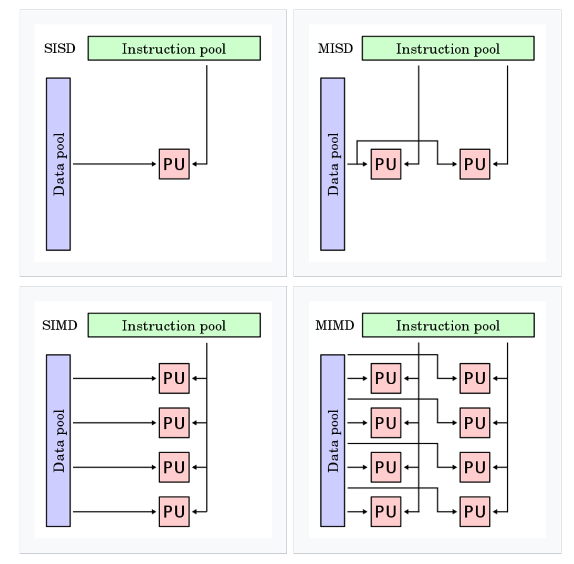

# Patterson and Hennessy 5th edition, Chapter 1

## Notes

Difference between a server and a warehouse-scale computer (WSC) is that a server consists of a single block of integrated computer hardware, whereas a WSC consists of many servers interconnected by a local area network. 

WSCs emphasize interactive applications, whereas supercomputers emphasize floating point performance. 

Dividing line between embedded systems and mobile devices is that mobile devices run third party software. 

Parallelism is the main driving force of improvements in computer design. 

Two kinds of parallelism in applications: 
- *Data-level parallelism (DLP): many data items can be operated on at the same time. 
- *Task-level parallelism (TLP)*: independent tasks can be executed at the same time. 

Computer hardware exploits these kinds of application parallelism in four ways: 
1. Instruction-Level Parallelism: exploits data-level parallelism with compiler help using ideas like pipelining (?) and speculative execution (?)
2. *Vector architectures and GPUs*: Exploits data-level parallelism by applying a single instruction to a collection of data in parallel. 
3. *Thread-level parallelism*: Exploits data-level or thread-level parallelism "in a tightly coupled hardware model that allows for interaction among parallel threads" (??????)
4. *Request-level parallelism*: Exploits parallelism among independent tasks specified by the programmer or operating system. 

Flynn's taxonomy of parallel computers (created by Michael Flynn in the 1960s): 

TODO: Add examples of each kind of processor. 

1. *Single instruction stream, single data stream* (SISD): The standard uniprocessor. Can exploit instruction-level parallelism. 
2. *Single instruction stream, multiple data streams (SIMD)*: like a GPU. 
3. *Multiple instruction stream, single data stream* (MISD): rare, use case is fault tolerance. 
4. *Multiple instruction stream, multiple data stream (MIMD)*: Targets task-level parallelism. More flexible than SIMD, but higher overhead. 

## Exercises
